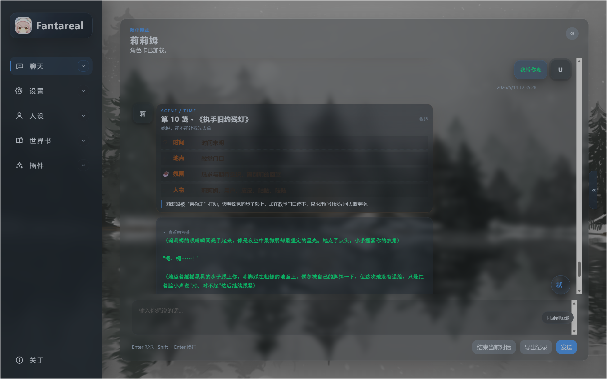

# Fantareal

<p align="center">
  
</p>

本地运行的 AI 伴侣聊天项目，基于 `FastAPI + WebUI`，支持角色卡、记忆库、世界书、预设、差分立绘、创意工坊、Mod 扩展和桌面启动器。


## 快速启动

双击 `启动webui.bat`，脚本会自动检测 Python、创建虚拟环境、安装依赖并启动服务。

或手动：

```powershell
cd "E:\AI chat 项目\Fantareal"
python -m venv .venv
.venv\Scripts\activate
pip install -r requirements.txt
uvicorn app:app --reload --host 127.0.0.1 --port 8000
```

然后打开 `http://127.0.0.1:8000`

## 基本使用

1. **配置模型** — 在 `/config` 填写 API URL、Key、Model，兼容 OpenAI Chat Completions 风格即可
2. **加载角色卡** — 在 `/config/card` 导入、编辑、导出，支持热切换
3. **管理记忆 / 世界书 / 预设** — 各自在对应页面维护，支持独立导入导出，设置页可一键打包四卡组合
4. **Mod 扩展** — `mods/` 目录下通过 `mod.json` 声明，运行时自动加载（当前内置：心笺、角色卡写手、灵魂织手、状态面板、酒馆转换器）
5. **路由转发** — `/config/route-forwarding` 配置多 Provider 路由、Key 轮换与故障转移
6. **Prompt 预览** — 聊天侧栏查看本轮注入的完整上下文

## 目录结构

```text
fantareal/        # 核心模块（路由、API、逻辑、数据模型）
mods/             # Mod 扩展
cards/            # 角色卡
data/             # 运行时数据
templates/        # 页面模板
static/           # 样式与静态资源
```

## 开源协议

本项目基于 GPL-3.0 许可证开源。

## 免责声明

本项目仅提供本地部署工具与开源源码，不提供任何在线模型服务、账号注册、托管或运营支持。

用户需自行配置第三方模型接口，并自行承担由此产生的合规、隐私、安全及使用责任。使用本项目时，请遵守所在地法律法规及相关第三方服务条款。

请勿将本项目用于生成、传播或存储任何违法违规内容，包括但不限于色情低俗、血腥暴力、未成年人不当内容、侵害他人合法权益或其他法律法规禁止的信息。

本项目开发者不对使用者基于本项目进行的二次部署、接口接入、内容生成或衍生用途承担责任。
