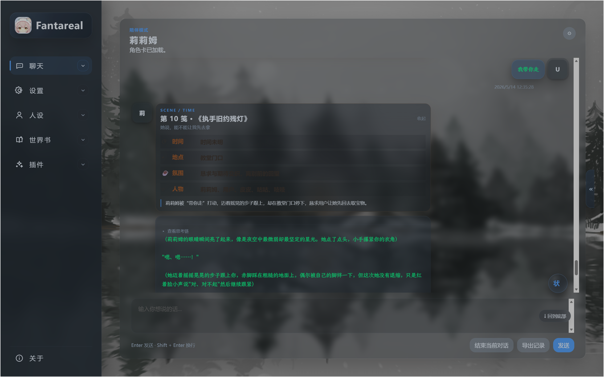

# Fantareal

<p align="center">
  
</p>

<h3 align="center">一个本地运行的 AI 角色聊天与创作工作台</h3>

<p align="center">
  
  
  
  
</p>


Fantareal 是一个可以在本地启动的 AI 聊天项目。

它不是只负责“发消息”的壳子，而是把角色卡、记忆、世界书、预设、Prompt 预览、Mod 扩展和桌面启动器放在一起，尽量让创作者能安静地写设定、调角色、跑剧情。

你可以把它理解成一个给幻想乡、OC、长期 RP 和剧情实验准备的 WebUI。

模型接口由你自己配置，数据主要留在本地，怎么写、怎么折腾，都更像是在打理自己的小工作室。

<br clear="right">

## 快速导航

[演示视频](#演示视频) ｜ [快速启动](#快速启动) ｜ [核心功能](#核心功能) ｜ [文档与教程](#文档与教程) ｜ [目录结构](#目录结构) ｜ [免责声明](#免责声明)

## 演示视频

想先看一眼 Fantareal 的开场和 WebUI 氛围，可以从这个视频开始：

> [Fantareal 自定义开场演示](https://www.bilibili.com/video/BV1gsLS6PEXL/)

## 快速启动

最简单的方式：

```text
双击 启动webui.bat
```

脚本会检查 Python、创建虚拟环境、安装依赖，然后启动本地 WebUI。

如果你想手动启动：

```powershell
cd Fantareal
python -m venv .venv
.\.venv\Scripts\activate
pip install -r requirements.txt
uvicorn app:app --reload --host 127.0.0.1 --port 8000
```

然后打开：

```text
http://127.0.0.1:8000
```

## 核心功能

- **聊天 WebUI**：本地页面启动，角色对话、Prompt 预览、侧栏调试都集中在聊天页。
- **角色卡**：导入、编辑、导出角色设定，适合维护 OC、NPC、剧情角色和长期 RP 卡。
- **记忆系统**：把已经发生过的事沉淀下来，用于长期对话里的召回和延续。
- **世界书**：按关键词、常驻、分组、触发规则，把本轮需要的设定临时补给模型。
- **预设与配置**：模型接口、API Key、Provider 路由、Prompt 模板等都可以在 WebUI 里维护。
- **Mod 扩展**：`mods/` 目录下可以挂载扩展模块，目前项目里已经有心笺、状态栏、世界书工具等方向的尝试。
- **本地资源管理**：角色卡、世界书、事件预设等素材可以放在 `assets/` 下，方便整理和分享。

## 文档与教程

如果你是第一次用，建议先看这里：

- [Fantareal_map 文档与教程](https://github.com/Frischar/Fantareal_map)：更适合作为公开文档入口，后续教程、截图和使用说明可以集中维护在这里。

本仓库里也保留了一些补充资料：

- `mods/state_journal/docs/`：心笺相关说明，适合想了解状态记录和长期剧情辅助的人。

README 先放主入口。更细的“主程序、角色、记忆、世界书”教程，建议放在 Discord 或 docs 目录里分章节维护。

## 讨论与社区

欢迎来这里提问、反馈、分享角色卡和世界书：

| 类别 | 入口 | 说明 |
| --- | --- | --- |
| Discord | [加入 Fantareal 交流区](https://discord.gg/EwYTWpqdqY) | 教程、反馈、素材分享、使用交流 |
| Issues | [GitHub Issues](https://github.com/Frischar/Fantareal/issues) | Bug、建议、可复现问题 |
| QQ | [加入我们](https://qm.qq.com/q/ke8LQ1WtJ6) |入门交流|


如果你只是想随便问问怎么用，社区会比 Issues 更合适。

如果你遇到了稳定复现的问题，Issues 会更方便追踪。

## 设计理念

Fantareal 更像一个“创作时的桌面”，而不是一个只追求一次回答的聊天框。

它想解决的不是“怎么让 AI 说一句漂亮话”，而是这些更麻烦、也更真实的问题：

- 角色设定很多，怎么别聊着聊着就散了。
- 剧情跑了很久，怎么让已经发生过的事还能被记住。
- 世界观太厚，怎么只在需要的时候把相关设定补进去。
- 工具越做越多，怎么还能让普通用户找得到入口。

所以这个项目会把很多东西拆开：角色归角色，记忆归记忆，世界书归世界书，Mod 归 Mod。

拆开以后会多一点学习成本，但好处是出了问题能查，设定变复杂以后也还能继续维护。

## 目录结构

```text
fantareal/          核心模块：路由、API、业务逻辑、数据模型
templates/          前端页面模板
static/             样式与静态资源
mods/               Mod 扩展
cards/              角色卡
data/               运行时数据
assets/             示例素材、预设、README 图片
```

## 开源协议

本项目基于 [AGPL-3.0](./LICENSE) 许可证开源。

## 免责声明

Fantareal 只提供本地部署工具与开源代码，不提供在线模型服务、账号注册、接口托管或内容运营支持。

你需要自行配置第三方模型接口，并自行承担由此产生的合规、隐私、安全和使用责任。使用本项目时，请遵守所在地法律法规以及相关第三方服务条款。

请勿将本项目用于生成、传播或存储任何违法违规内容，包括但不限于色情低俗、血腥暴力、未成年人不当内容、侵害他人合法权益或其他法律法规禁止的信息。

项目开发者不对使用者基于本项目进行的二次部署、接口接入、内容生成或衍生用途承担责任。
